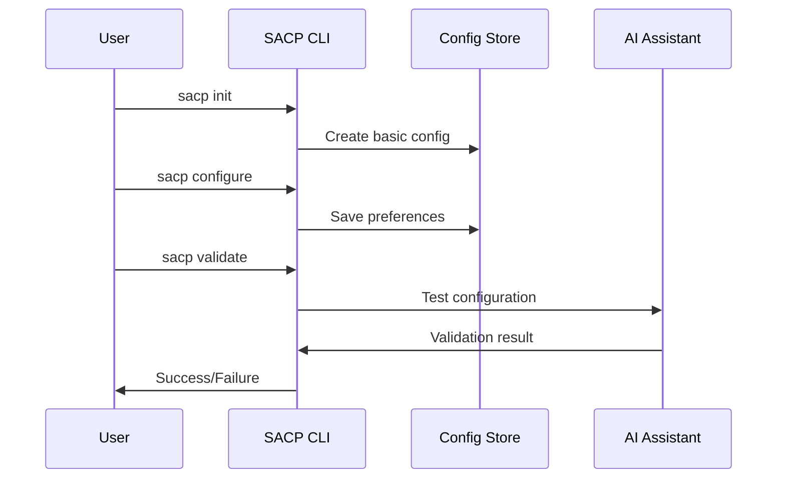

# First User Test Strategy

## 1. Minimal Test Scenario

### User Story
```yaml
as_user:
  i_want_to:
    - Configure my AI assistant behavior
    - Have consistent responses
    - Validate the configuration works
  
  so_that:
    - My AI assistant behaves predictably
    - I save time on repetitive setups
    - I get consistent quality
```

### Minimal Test Flow


## 2. Required Components

### Phase 1: Basic Configuration (2 weeks)
```yaml
components:
  cli:
    - Basic command structure
    - Config file handling
    - Simple validation
    estimated_time: "1 week"
    resources: "1 developer"

  config_store:
    - YAML file based
    - Basic schema validation
    - Version tracking
    estimated_time: "3 days"
    resources: "1 developer"

  ai_integration:
    - Simple Codeium connection
    - Basic prompt testing
    - Response validation
    estimated_time: "4 days"
    resources: "1 developer"
```

### Phase 2: User Testing (1 week)
```yaml
components:
  documentation:
    - Installation guide
    - Basic usage examples
    - Configuration reference
    estimated_time: "2 days"
    resources: "1 developer"

  testing:
    - User test scenarios
    - Feedback collection
    - Bug fixing
    estimated_time: "3 days"
    resources: "1 developer"
```

## 3. Resource Requirements

### Development Team
```yaml
minimal_team:
  core_developer:
    skills:
      - Python expertise
      - CLI development
      - API integration
    time_commitment: "Full-time"

  optional:
    technical_writer:
      skills:
        - Documentation
        - User guides
      time_commitment: "Part-time"
```

### Technical Stack
```yaml
requirements:
  development:
    - Python 3.11+
    - Click (CLI framework)
    - PyYAML
    - Codeium API access

  testing:
    - pytest
    - CLI test framework
    - Documentation tools

  deployment:
    - pip package
    - GitHub releases
```

## 4. Timeline

### Week 1: Core CLI
```yaml
tasks:
  - Setup project structure
  - Implement basic CLI
  - Create config handling
  - Add simple validation

deliverables:
  - Working CLI skeleton
  - Basic config management
  - Initial tests
```

### Week 2: AI Integration
```yaml
tasks:
  - Implement Codeium connection
  - Add prompt management
  - Create validation logic
  - Basic error handling

deliverables:
  - Working AI integration
  - Basic validation system
  - Integration tests
```

### Week 3: Testing & Documentation
```yaml
tasks:
  - Write documentation
  - Create user guides
  - Conduct user testing
  - Fix issues

deliverables:
  - Complete documentation
  - Test results
  - Bug fixes
```

## 5. Success Criteria

### Technical
```yaml
criteria:
  installation:
    - Simple pip install
    - Clear requirements
    - Quick setup

  functionality:
    - Commands work as expected
    - Config properly saved
    - AI responds correctly

  performance:
    - CLI responds < 1s
    - AI setup < 30s
    - No major bugs
```

### User Experience
```yaml
criteria:
  usability:
    - Clear command structure
    - Helpful error messages
    - Good documentation

  effectiveness:
    - Configuration works
    - AI behavior consistent
    - Time saved vs manual
```

## 6. Risk Management

### Technical Risks
```yaml
risks:
  ai_integration:
    risk: "API changes or limitations"
    mitigation: "Version locking, fallback modes"

  configuration:
    risk: "Complex user needs"
    mitigation: "Start simple, iterate based on feedback"

  performance:
    risk: "Slow AI responses"
    mitigation: "Caching, async operations"
```

### Resource Risks
```yaml
risks:
  development:
    risk: "Time constraints"
    mitigation: "Focus on core features first"

  testing:
    risk: "Limited user feedback"
    mitigation: "Internal testing, automated tests"
```

## 7. Next Actions

### Immediate (Next 24h)
1. Setup development environment
2. Create project structure
3. Start CLI development
4. Begin documentation

### This Week
1. Complete basic CLI
2. Implement config storage
3. Add simple validation
4. Start AI integration

### Next Week
1. Complete AI integration
2. Add validation system
3. Prepare for user testing
4. Write documentation
