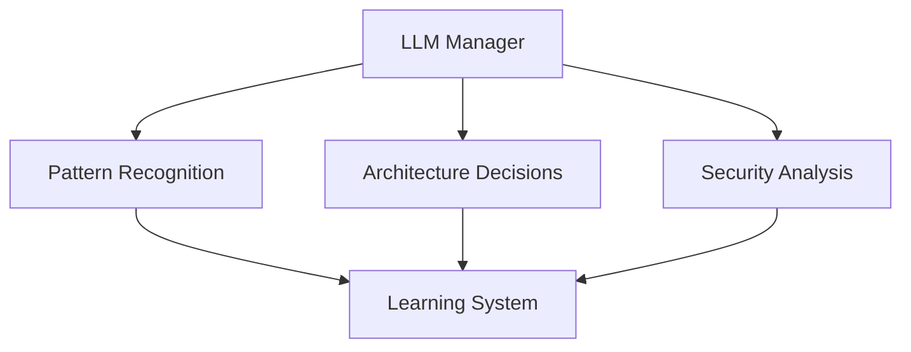
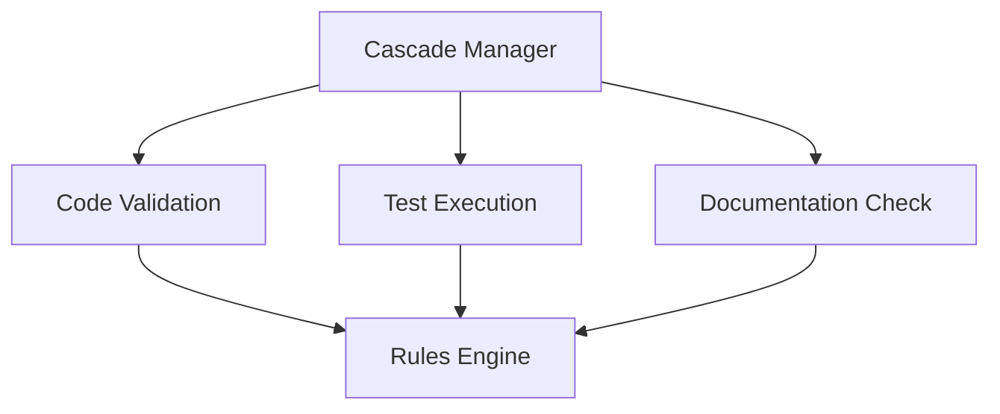
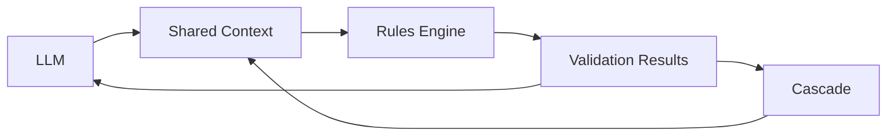

# Technical Implementation Notes

## AI Integration Architecture

### 1. Core Components

#### LLM (Strategic Brain)


**Key Decisions:**
1. Use Claude 3.5 Sonnet for optimal balance of performance and cost
2. Implement context persistence for continuous learning
3. Separate strategic and tactical decisions
4. Maintain state through validation history

**Rationale:**
- Claude offers superior context understanding
- Persistent context enables long-term learning
- Clear separation of concerns improves maintainability
- Historical validation enables pattern recognition

#### Cascade (Execution Engine)


**Key Decisions:**
1. Implement rules as composable units
2. Use event-driven validation
3. Maintain separate validation contexts
4. Enable real-time feedback

**Rationale:**
- Composable rules allow flexible validation
- Event-driven approach reduces coupling
- Context separation improves accuracy
- Real-time feedback speeds development

### 2. Integration Points

#### Data Flow


**Implementation Details:**
1. Shared memory through `.windsurf_rules`
2. Event-based communication
3. Bidirectional validation flow
4. Context-aware decision making

#### Learning System
```yaml
learning:
  patterns:
    collection:
      interval: 5m
      batch_size: 100
    analysis:
      confidence_threshold: 0.85
      min_occurrences: 3
  thresholds:
    adjustment:
      rate: 0.15
      min_samples: 10
```

### 3. Validation Rules

#### Rule Types
1. **Strategic Rules** (LLM)
   ```python
   class StrategicRule:
       def validate(self, context):
           pattern_match = self.detect_pattern(context.code)
           architecture_valid = self.validate_architecture(context.structure)
           security_check = self.analyze_security(context.dependencies)
           return all([pattern_match, architecture_valid, security_check])
   ```

2. **Tactical Rules** (Cascade)
   ```python
   class TacticalRule:
       def validate(self, context):
           syntax_valid = self.check_syntax(context.code)
           tests_pass = self.run_tests(context.tests)
           docs_complete = self.verify_docs(context.documentation)
           return all([syntax_valid, tests_pass, docs_complete])
   ```

### 4. Security Considerations

#### Authentication
- API keys stored in environment variables
- Rotating keys every 30 days
- Rate limiting implemented
- Request signing for critical operations

#### Validation
- Input sanitization at all levels
- Pattern-based security checks
- Dependency vulnerability scanning
- Runtime security monitoring

### 5. Performance Optimization

#### Caching Strategy
```python
class ValidationCache:
    def __init__(self):
        self.cache = LRUCache(maxsize=1000)
        self.ttl = timedelta(minutes=30)
    
    def get_validation(self, context_hash):
        if self.cache.has(context_hash):
            result = self.cache.get(context_hash)
            if not result.is_expired(self.ttl):
                return result
        return None
```

#### Batch Processing
- Aggregate validation requests
- Parallel rule processing
- Prioritized validation queue
- Resource-aware scheduling

### 6. Testing Strategy

#### Unit Tests
- Each rule component tested independently
- Mock responses for LLM calls
- Validation context simulation
- Edge case coverage

#### Integration Tests
- End-to-end validation flow
- Cross-component communication
- Performance benchmarks
- Security compliance

### 7. Monitoring & Metrics

#### Key Metrics
1. **Performance**
   - Response time < 200ms
   - CPU usage < 30%
   - Memory < 500MB
   - Cache hit rate > 80%

2. **Quality**
   - False positive rate < 5%
   - Pattern recognition accuracy > 90%
   - Learning convergence rate
   - Rule effectiveness score

3. **Security**
   - Zero critical vulnerabilities
   - Authentication success rate
   - Suspicious pattern detection
   - Dependency health score

### 8. Future Improvements

#### Short Term
1. Enhance pattern recognition
2. Implement cross-project learning
3. Add security vulnerability prevention
4. Optimize cache strategy

#### Long Term
1. Advanced AI capabilities
2. Predictive code analysis
3. Automated refactoring
4. Self-optimizing rules

## Technical Debt Tracking

### Current Items
1. ✅ Basic validation implementation
2. ✅ LLM integration
3. ✅ Rule engine structure
4. ⏳ Advanced pattern recognition
5. ⏳ Performance optimization
6. ⏳ Security hardening

### Prevention Strategy
1. Regular architecture reviews
2. Continuous testing
3. Documentation updates
4. Performance monitoring
5. Security scanning
