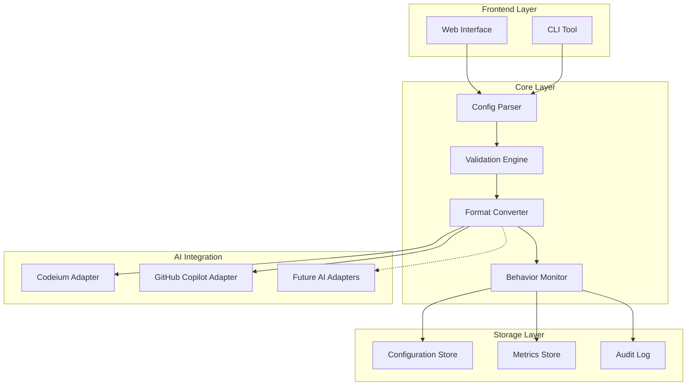

# SACP v2 MVP Technical Vision

## Core Architecture



## Functional Components

### 1. Configuration Management
```yaml
core_components:
  parser:
    purpose: "Parse and validate configuration files"
    features:
      - YAML/JSON format support
      - Schema validation
      - Version control
      - Inheritance support
    mvp_scope:
      - Basic YAML parsing
      - Simple validation
      - File-based storage

  validator:
    purpose: "Ensure configuration quality and compliance"
    features:
      - Syntax validation
      - Semantic validation
      - Cross-AI compatibility
      - Security rules
    mvp_scope:
      - Basic syntax check
      - Format validation
      - Simple security rules
```

### 2. AI Integration
```yaml
adapters:
  common_features:
    - Configuration translation
    - Response validation
    - Behavior monitoring
    - Error handling

  codeium:
    mvp_features:
      - Basic prompt conversion
      - Memory integration
      - Response validation
    future:
      - Advanced memory mapping
      - Custom extensions

  github_copilot:
    mvp_features:
      - IDE integration
      - Basic prompt support
      - Response validation
    future:
      - Advanced context handling
      - Team settings
```

### 3. Monitoring & Metrics
```yaml
monitoring:
  behavior:
    tracking:
      - Response consistency
      - Configuration adherence
      - Error patterns
    alerts:
      - Validation failures
      - Security violations
      - Performance issues

  metrics:
    collection:
      - Response times
      - Success rates
      - Usage patterns
    analysis:
      - Trend detection
      - Quality scoring
      - Performance impact
```

## MVP Implementation Phases

### Phase 1: Foundation
```yaml
core_setup:
  - Basic configuration parser
  - Simple validation rules
  - File-based storage
  - CLI interface

metrics:
  - Configuration parse success
  - Basic validation metrics
  - Storage performance
```

### Phase 2: AI Integration
```yaml
codeium_integration:
  - Basic prompt conversion
  - Simple memory integration
  - Response validation

copilot_integration:
  - Basic IDE integration
  - Simple prompt support
  - Basic validation
```

### Phase 3: Monitoring
```yaml
monitoring_setup:
  - Basic behavior tracking
  - Simple metrics collection
  - Error logging
  - Performance monitoring
```

## Technical Requirements

### 1. Core System
```yaml
requirements:
  language: "Python 3.11+"
  storage: "SQLite/PostgreSQL"
  api: "FastAPI"
  documentation: "OpenAPI/Swagger"
```

### 2. Integration
```yaml
requirements:
  protocols:
    - REST API
    - WebSocket (for real-time)
    - Git integration
  
  security:
    - API authentication
    - Data encryption
    - Audit logging
```

### 3. Deployment
```yaml
requirements:
  hosting:
    - Docker support
    - Kubernetes optional
    - Cloud-ready
  
  scaling:
    - Horizontal scaling
    - Load balancing
    - Cache support
```

## Success Metrics

### 1. Technical Metrics
```yaml
performance:
  - Response time < 100ms
  - 99.9% uptime
  - < 1% error rate

scalability:
  - Support 100+ concurrent users
  - Handle 1000+ configs
  - Process 10k+ requests/day
```

### 2. Functional Metrics
```yaml
effectiveness:
  - 95% config conversion success
  - 90% validation accuracy
  - 85% user satisfaction

adoption:
  - 10+ enterprise users
  - 100+ individual users
  - 1000+ configurations
```

## Next Steps

### Immediate Actions
1. Set up core infrastructure
2. Implement basic parser
3. Create Codeium adapter
4. Develop simple CLI

### Technical Decisions Needed
1. Storage solution selection
2. API authentication method
3. Deployment strategy
4. Monitoring tools
